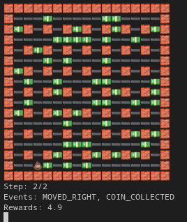

# bomberman_rl - BomberGym

Bombergym features a rewrite of the original bomberman_rl game engine in order to be compatible with [OpenAI Gym](https://gym.openai.com/). By providing a gym compatible environment of bomberman, we hope to make our lives a bit easier: 

1. We want to be able to quickly experiment and iterate on cutting edge RL algorithms - many Deep RL libraries, for example [stable_baselines3](https://stable-baselines3.readthedocs.io/en/master/), can simply be directly plugged into an existing gym environment.
2. We can use the existing ecosystem and libraries to avoid having to write boilerplate. For example, we can use `make_vec_env` from `stable_baselines3` to create vectorized environments and train our agent in parallel without having to worry how to do this with the existing game engine.
3. We can make development and collaboration easier and more streamlined by clearly separating what makes up the environment (observation space, action space, rewards) and what makes up our reinforcement learning algorithm and training routines.

Also, we completely ripped out pygame (sorry, it's fun and looks great, but not practical), and replaced it with a CLI based rendering of the game:



## Usage

**Installing**: After activating whatever Python virtual env management, run `pip install -r requirements.txt`. Tested on Python 3.9. The underlying Bomberman-RL project requires Python 3.8+.

**Testing**: To run unit tests, run `python -m unittest`

**Playing the game:** To play the game in the terminal, run `python main_gym_play.py`. Requires some unicode support in your terminal (it's 2022). The 💩 is the agent. Vim Keybindings (h, j, k, l: movement, b: place a bomb, any other key: wait). We will show you rewards and also the observation space and events after each step. 

## Environments

We provide different versions of the bomberman game as environments. All Gym observation spaces are directly and purely computed from the original `game_state` provided to allow our model to plug into the original game again easily for the competition. 

### BomberGym-v0

`BomberGym-v0` is the most basic and naive environment. It is inspired by the gym classic control environments for Atari games, where simply the RGB values or even the 128-byte RAM is given as observation space. We simply translate the `game_state` into a 2-dimensional array (kind of like a RGB image version of the game, just more condensed):

```python
>>> import gym
>>> from bombergym.scenarios import coin_heaven
>>> from bombergym.environments import register
>>> 
>>> register() # Register our custom environments to gym
>>> settings, agents = coin_heaven() # Play in coin heaven scenario
>>> 
>>> env = gym.make('BomberGym-v0', args=settings, agents=agents)
>>> env.reset()
array([[-2, -2, -2, -2, -2, -2, -2, -2, -2, -2, -2, -2, -2, -2, -2, -2, -2],
       [-2,  0,  0,  0,  0,  0,  0,  0,  3,  0,  3,  0,  3,  0,  3,  3, -2],
       [-2,  3, -2,  0, -2,  0, -2,  0, -2,  0, -2,  3, -2,  0, -2,  0, -2],
       [-2,  0,  3,  0,  0,  0,  0,  3,  3,  3,  0,  0,  0,  0,  0,  0, -2],
       [-2,  0, -2,  0, -2,  0, -2,  0, -2,  0, -2,  0, -2,  3, -2,  3, -2],
       [-2,  3,  0,  0,  3,  0,  0,  3,  0,  0,  0,  3,  0,  0,  3,  0, -2],
       [-2,  3, -2,  0, -2,  0, -2,  3, -2,  3, -2,  0, -2,  3, -2,  3, -2],
       [-2,  0,  0,  0,  0,  0,  0,  3,  0,  0,  3,  0,  0,  0,  0,  0, -2],
       [-2,  3, -2,  0, -2,  3, -2,  0, -2,  3, -2,  3, -2,  3, -2,  0, -2],
       [-2,  3,  0,  0,  0,  0,  3,  0,  3,  0,  3,  0,  0,  0,  3,  0, -2],
       [-2,  0, -2,  0, -2,  0, -2,  0, -2,  0, -2,  0, -2,  0, -2,  0, -2],
       [-2,  3,  0,  3,  0,  3,  3,  0,  0,  0,  0,  0,  0,  3,  0,  0, -2],
       [-2,  3, -2,  0, -2,  0, -2,  0, -2,  0, -2,  0, -2,  0, -2,  0, -2],
       [-2,  0,  0,  3,  0,  0,  0,  0,  0,  0,  0,  0,  0,  0,  0,  0, -2],
       [-2,  3, -2,  0, -2,  0, -2,  0, -2,  3, -2,  0, -2,  3, -2,  0, -2],
       [-2,  0,  3,  0,  0,  3,  3,  0,  0,  3,  0,  0,  0,  3,  0,  2, -2],
       [-2, -2, -2, -2, -2, -2, -2, -2, -2, -2, -2, -2, -2, -2, -2, -2, -2]])
```

The array is simply a representation of the field as we see in the GUI, where the numbers have the following meanings:

```
EXPLOSION = -4
BOMB = -3
WALL = -2
ENEMY = -1
EMPTY = 0
CRATE = 1
SELF = 2
COIN = 3
```

So far, we have not achieved great results from this environment alone. Even when using an advanced RL policy. A reason could be that the Markov property is not entirely fulfilled here - the information of *when* a bomb will explode is not encoded. As such, the agent doesn't really learn how to not blow up.

The following rewards are defined for this environment (as in the original game scaffolding, they are based on events - the sum of all occuring events is returned as the step reward):

```
e.COIN_COLLECTED: 5,
e.INVALID_ACTION: -1,
e.KILLED_OPPONENT: 5,
e.SURVIVED_ROUND: 1,
e.MOVED_DOWN: -.1,
e.MOVED_LEFT: -.1,
e.MOVED_RIGHT: -.1,
e.MOVED_UP: -.1,
e.WAITED: -.3,
BOMB_FLED: 3,
WALKS_INTO_BOMB_RADIUS: -3,
AGENT_MOVED_OUT_OF_BOMB_TILE: 2
```

Notably, `BOMB_FLED` will reward the agent if it was in blast radius, but fled. `WALKS_INTO_BOMB_RADIUS` does the opposite. `AGENT_MOVED_OUT_OF_BOMB_TILE` tries to give an incentive to put a movement command after placing a bomb. The only thing we got from these events though, is an agent that will place a bomb, duck behind a corner, place another bomb, et cetera - exploiting the `BOMB_FLED` reward, but not making progress. So, probably not a great idea, but interesting nonetheless.

### BomberGym-v1

We have some preliminary promising results with BomberGym-v1.

```
>>> env=gym.make('BomberGym-v1', args=settings,agents=agents)
>>> env.reset()
Out[5]: 
array([0.        , 0.        , 0.        , 0. # bomb awareness       
     , 0.        , 0.        , 0.        , 0. # explosion awareness       
     , 0.        , 0.        , 0.        , 0. # crate awareness       
     , 0.07142857, 0.        , 0.        ,0.11111111 # coin awareness
     , 0.        , 0.        , 0.        , 0. # enemy awareness      
     , 1.        , 0.        , 0.        , 1. # wall awareness       
     , 0. # is a bomb under me?      
     ])
```

Awareness features are 1 divided by the tile distance to a certain thing in 
any direction. 4 features for a given thing, left, right, top, bottom.
With this, we can solve coin_heaven, but slow: literally only encodes the line
of sight of the agent, so has to spend a long time randomly searching once a
"signal" to a coin is lost.

Rewards given:

```
e.COIN_COLLECTED: 5,
e.INVALID_ACTION: -1,
e.KILLED_OPPONENT: 5,
e.SURVIVED_ROUND: 1,
e.MOVED_DOWN: -.1,
e.MOVED_LEFT: -.1,
e.MOVED_RIGHT: -.1,
e.MOVED_UP: -.1,
e.WAITED: -.3,
```

### BomberGym-v2

`Codename: Manhattan`

We like how BomberGym-v1 performs and is able to solve the coin-heaven without
big problems. However, it's just too damn slow - python-pathfinding is the
main reason, and also our implementation is far from optimal. Can we do better?
Turns out - replacing the complicated pathfinding algorithm with the manhattan
distance, and keeping everything else the same converges to the same reward -
and we can process 300 frames per second again instead of 3 frames per second in
the pathfinding variant. Quite unexpected!

### BomberGym-v3

`Codename: Manhattan V2`

In BomberGym-v2 we didn't play with rewards. In particular, in the rewards until
now a suicide penalty is missing. We address this in this environment.
Everything else is the same to `BomberGym-v2` (I think, gotta check it again)

```
e.COIN_COLLECTED: 5,
e.INVALID_ACTION: -1,
e.KILLED_OPPONENT: 10,
e.SURVIVED_ROUND: 10,
e.KILLED_SELF: -10,
e.MOVED_DOWN: -.5,
e.MOVED_LEFT: -.5,
e.MOVED_RIGHT: -.5,
e.MOVED_UP: -.5,
e.WAITED: -.8,
e.CRATE_DESTROYED: 3,
e.BOMB_DROPPED: -1,
```

### BomberGym-v4

`Codename: Cnnboard`

Trying out a kind of stupid idea. Work in progress. Back to the roots - similar
to plain boards, but different channels conveying different information, like
r,g,b channels in image, grid,danger,enemy,coin,crate channel - put into CNN.
Collect data with rule-based agent and injected randomness. Try to teach a CNN
to play like rule_based agent in a supervised setting. Some promising results so far.
Idea: can we use this as pretraining, and then fine tune our results with Deep-Q Atari
Deepmind approach? Todo.
